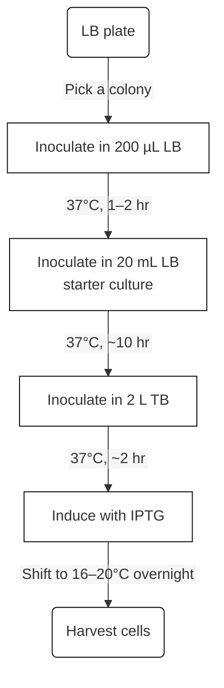

# Beads-coupled protein pull-down

[TOC]

## Expression of GST fusion protein in BL21 cells

### Recipes

<u>**Terrific Broth (TB) Medium (1L)**</u>

12 g bactotrypton

24 g yeast extract

4 mL glycerol

100 mL potassium phosphate buffer

Aqua dest 900 mL

<u>potassium phosphate buffer (100 mL) for TB medium</u>

KH~2~PO~4~ 0.17 M (2.31 g)

K~2~HPO~4~ 0.72 M (12.54 g)

Aqua dest 100 mL

**Autoclave @115°C 20 min**

### Procedures

> **Before start:**
>
> * Add any antibiotic to the medium freshly before culturing. This applies to all subsequent steps involving antibiotics.
> * Pre-warm any medium in a shaking incubator before each stepwise culture to ensure that the growth rate of *E. coli* meets expectations.

1. Pick single colony to 200 µL LB medium w/ antibiotic. Incubate 1–2 hr.

2. Inoculate starter culture (20 mL) in LB w/ Ab (**pre-warm at 37°C**) ~10 hr.

3. Aspirate ~5mL sterile TB into cuvette for OD (Optical density) measurement blank control.

4. Dilute starter 1:100 and grow for ~2 hr at 37°C (**pre-warm at 37°C**).

   > **Monitor OD frequently in advance**, as *E. coli* grows rapidly near the log phase.

5. Measure OD~600~ until it reaches 0.5–0.6, induce protein expression by adding 0.1–0.2 mM IPTG.

   > Record OD~600~. Take "un-induced" fraction for SDS-PAGE analysis as following described:
   >
   > 1. Aspirate 1 mL of bacterial culture from the cuvette into each of two Eppendorf tubes.
   > 2. Centrifuge at 12,000 rpm for 1–2 min.
   > 3. Discard the supernatant, invert the tubes on tissue to remove excess medium.
   > 4. For each tube, resuspend the pellet in 10 µL distilled water. Mix thoroughly with 10 µL 2× Laemmli buffer by pipetting.
   > 5. Label and store fraction at -20 °C.

6. Transfer culture to cold room shaker ~16 hr @16–20°C.

   > Prepare ~10 mL sterile TB as OD measurement blank control.
   >
   > Measure OD~600~, normalize OD (usually dilute 3x volume with medium). Take 20 µL for SDS-PAGE ("induced" fraction) as describe above.

7. Pellet bacteria by spinning at 5000 rpm at 4°C for 15 minutes (**pre-chill machine at 4°C**).

8. Discard supernatant and either freeze pellets at –20°C or begin lysis.



**Fig:** Flowchart of protein prokaryotic expression in BL21 cells under stepwise culture.

## Purification of GST fusion proteins

### Recipes

**<u>Lysis buffer</u>**

50 mM Tris pH 8

150 mM NaCl (MW = 58.44 g/mol)

0.05% NP40

0.5 mM PMSF **(add freshly!!!)**

1 mM DTT **(add freshly!!!)**

> The buffering component (Tris) can be substituted with alternatives such as MES ([Good's buffers](https://en.wikipedia.org/wiki/Good%27s_buffers)), bicarbonate, or phosphate, depending on experimental requirements.

**<u>Elution buffer</u>**

100 mM Tris pH 8.0

10% Glycerol

15 mg/mL reduced glutathione (MW 307.33)

> Alternatively, dissolve reduced glutathione in the lysis buffer to a final concentration of 15 mg/mL.

### Procedures

1. Resuspend bacteria in **pre-chilled lysis buffer** (5–10 mL for a pellet from 500 mL culture).

2. Add fresh PMSF and DTT immediately to suspension before lysis.

3. Lyse cells using microfluidizer (>3 passes, **pre-chill machine at 4°C**).

   > Take 10 µL for SDS-PAGE, mix thoroughly w/ 10 µL 2× Laemmli buffer, label as "supernatant (S)", store at -20°C.
   >
   > Wash microfluidizer w/ 3x distilled water and 3x lysis buffer before use.

4. Spin at 12K rpm for 30 minutes (**pre-chill machine and Falcon tubes at 4°C**).

   > Resuspend pellet in equal volume of supernatant w/ lysis buffer. Take 10 µL for SDS-PAGE (“pellet (P)”), same as described above.

5. Repeat spinning until the pellet is nearly invisible in the Falcon tube. Transfer the protein suspension to a new pre-chilled Falcon tube.

6. Wash 2 mL glutathione beads 3× with 3x bead volume lysis buffer (400 g, 2 min per wash).

   > If the beads are stored in 20% ethanol, first wash the beads with 3x 5x beads volume distilled water to remove the ethanol.
   >
   > Use a wide-bore pipette tip when handling beads and <u>*never* spin >400 g</u>.
   >
   > *Alternatively, wash beads in the gravity column.*

7. After spinning, keep the supernatant, decanting into a 50 mL Falcon tube containing pre-washed glutathione beads.

8. Incubate ≥3h at 4°C on a rotator.

9. Pour beads into gravity-flow column.

   > Collect 10 µL of “flow-through (FT)” for SDS-PAGE.
   >
   > *Wash the residual beads in the Falcon tube with 3x bead volume.*

10. Equip the gravity column with an infusion rate controller to regulate the flow rate (<u>recommended at 1 drop per second</u>).

11. Wash 5× with 3× beads volume lysis buffer.

    > **Wash gently — avoid disturbing the bead bed.**
    > Collect 10 µL of “Wash fraction (W)” for SDS-PAGE.

12. Add 1× bead volume GST-PreScission Protease. Incubate overnight at 4°C.

    > Alternatively, add elution buffer directly (see recipes) to elute GST-tagged proteins, and proceed with the "elute and take" cycle as following described.\*

13. Collect elution fractions in Eppendorf tubes\*\* (1–2 mL each; label as "E1", "E2", etc.).

    * For GST-PreScission treatment, add lysis buffer.

    * For GSH treatment, add elution buffer.

      > Take 10 µL from each fraction for SDS-PAGE.

14. Analyze protein factions via SDS-PAGE.

15. Measure protein concentration using Bradford or Qubit assay.

16. Recycle glutathione beads. Wash with 6 M guanidine hydrochloride (MW 95.54, ≥5x bead volume) to remove residual proteins and debris.

    > Take 10 µL "bead-bound" fraction for SDS-PAGE.

17. Wash thoroughly with distilled water (≥10x bead volume). Store in 20% ethanol at 4°C.

**Notes**

\* Following this method, if the target protein without the GST tag is required:

1. Measure the eluted protein concentration.

   > Collect 10 µL of "Before-cleavage" fraction for SDS-PAGE.

2. Add PreScission protease into the protein solution at a desired ratio (e.g., 1:50 enzyme-to-substrate ratio).

3. Perform cleavage overnight at 4 °C during dialysis to remove excess GSH.

   > Collect 10 µL of "After-cleavage" fraction for SDS-PAGE.

4. Reapply the sample to the gravity column.

5. Collect the flow-through in 1–1.5 mL aliquots

   > FT contains the target protein without GST tag.
   >
   > Take 10 µL from each and label as "FT1", "FT2", etc.

\*\* For short-term storage, place the protein solution on ice and store in a cold room with the lid on the ice box.

If the purified protein is not subjected to use immediately, proceed as following described:

1. Add glycerol to a final concentration of 20%.
2. Mix thoroughly for 30 minutes on a rotator at 4°C (avoid vortex)
3. Freeze in liquid nitrogen, and store at -80°C.

## Immobilization of purified proteins (CNBr-Sepharose Assay)

### Recipes
<u>**CNBr-activated [Sepharose](https://wwwuser.gwdguser.de/~jgrossh/protocols/protein-purification/CNBr-Sepha.pdf) (Pharmacia)**</u>

> Sepharose is supplied lyophilized in the presence of additives. These additives must be washed away at low pH (pH 3) before coupling the desired ligand.

<u>**1 mM HCl**</u>

**<u>Coupling buffer, pH 8.3</u>**

0.1 M NaHCO~3~

0.3–0.5 M NaCl

> The coupling reaction proceeds most efficiently in the pH range 8–10 where the amino groups on the ligand are predominantly in the unprotonated form.
>
> Bicarbonate or borate buffers lack amino group, which will not compete with the activating group.

<u>**Blocking buffer**</u> 

0.1 M Tris/HCl pH 8.0

<u>**Washing buffer I, pH 4.0**</u>

0.1 M NaAc

0.5 M NaCl

<u>**Washing buffer II, pH 8.0**</u>

0.1 M Tris/HCl pH 8.0

0.5 M NaCl

<u>**Protein solution**</u>

**!!! Dialyze to coupling buffer.**

The concentration should be as high as possible, ideally > 5 mg/mL.

> For an efficient adsorbent of protein ligands, 5–10 mg protein per ml medium is recommended.

**Calculations**

```
For one coupling and subsequent pull-down experiment, prepare 200 µL gel.

1 g (sepharose) materials -> 3.5 mL gel

**0.1 g materials -> 0.35 mL gel

gel vol. : protein suspension vol. = 1 : 2
protein suspension vol. = 0.7 mL
protein suspension conc. = 5–10 mg/mL
protein suspension amount = 3.5 mg (if conc. = 5 mg/mL)

ideal gel coupling ratio:
5–10 mg protein per mL gel is recommended
For 0.35 mL gel, 0.35*(5–10) = 1.75–3.5 mg is recommended


**0.06 g materials -> 0.2 mL gel

gel vol. : protein suspension vol. = 1 : 2
protein suspension vol. = 0.4 mL
protein suspension conc. = 5–10 mg/mL
protein suspension amount = 2 mg (if conc. = 5 mg/mL)

ideal gel coupling ratio:
5–10 mg protein per mL gel is recommended
For 0.2 mL gel, 0.2*(5–10) = 1–2 mg is recommended
```

### Procedures

#### Protein preparation

> **!!! Before start: Avoid any buffer containing amino groups such as Tris because they will react with the BrCN groups.**

Dialyze Tris-containing protein solution against coupling buffer (Three times, 100x volumes). Make sure that all amino groups are removed completely.

For native proteins, dissolve proteins in coupling buffer (5–10 mg protein per mL gel).

> Make sure that your protein is soluble in the coupling buffer. If not adjust the coupling buffer according to the recommendations in the booklet.

#### Preparation of the CNBr-activated Sepharose

> **Start with these steps only when all materials are ready. The BrCN-sepharose beads are NOT stable in coupling buffer.**

1. Let dry material swell in 10 mL 1 mM HCl for 15 min. 1 g material will give about 3.5 mL gel.

2. Wash on a sintered glass filter (porosity G3) with about 200 ml 1 mM HCI per gram dry gel. Add wash in several aliquots.

   > Note: HCI preserves activity of the reactive groups which hydrolyze at high pH.
   


#### Coupling

1. Calculate Gel Volume use a <u>gel</u> : <u>protein suspension</u> ratio of 1 : 2 (v/v).
   > *E.g., add 1 mL gel to 2 mL protein solution.*

2. Wash gel with **cold coupling buffer** (5 mL per gram of dry gel).

3. **<u>Immediately</u>** after washing, add gel to protein suspension.

4. Mix gel with protein solution with an end-over-end mixer or rocker for 3 hr at r.t. or at 4ºC over night. Use a 15 ml conical tube.
   > Note: avoid magnetic stirrer.

5. Aspirate coupling buffer (unbound protein fraction); check for binding efficiency by protein assay such as Bradford or A280.

6. Add blocking buffer to gel and mix for 2 hr at r.t. of at 4°C over night.

7. Pour the bead suspension into a gravity-flow column.

8. Perform 5x 5 volumes alternating pH washing with:

   * Low pH buffer (Washing buffer **I**)

   * High pH buffer (Washing buffer **II**)

9. Wash with 5 volumes of PBS.

10. Store column in PBS, 0.02% NaN~3~ at 4°C.

## Immobilization of purified proteins (Dynabeads Assay)

### Recipes

**<u>[Dynabeads® MyOne™](https://www.thermofisher.com/hk/en/home/references/protocols/proteins-expression-isolation-and-analysis/protein-isolation-protocol/dynabeads-myone-carboxylic-acid.html) Carboxylic Acid</u>**

> The concentration of the supplied beads is 10 mg/mL.
>
> 1 mg beads =  100 µL.

**<u>Protein suspension (dissolved in MES buffer)</u>**

**<u>15 mM MES, pH 6 (100 mL)</u>**

0.32 g MES (2-[N-morpholino]ethane sulfonic acid, MW 213.25). Dissolve in 90 mL distilled water, adjust to pH 6 and adjust to 100 mL.

**<u>EDC (10 mg/mL)</u>**

10 mg EDC (N-Ethyl-N'-(3-dimethylaminopropyl)carbodiimide hydrochloride, MW 191.7).

**Dissolve in 1 mL cold purified water immediately before use.**

**Notes:**

* This protocol is based on **1 mL (10 mg)** Dynabeads® magnetic beads, but can be directly scaled up.
* Use ~500 µg protein/mL Dynabeads® magnetic beads.
* The total volume during coupling should be adjusted so that the final Dynabeads® magnetic beads concentration is 20–50 mg/mL.
* The required amount of EDC varies depending on the performed coating procedure.

### Procedures

#### Dialysis for protein suspension 

**Before start:**

* **Pre-chill any buffer before dialysis**, which ensures that the protein environment will not undergo drastic changes when replacing the dialysis solution.

* Wear gloves when handling the dialysis membrane. Direct contact with skin may introduce oils or other contaminants.

* **Avoid re-drying the dialysis membrane after activation.** Boiling water ensures rapid hydration and expansion of the membrane. Drying the hydrated membrane makes it prone to tearing or cracking.

* For large shifts in pH or buffer strength, perform **stepwise (gradient) dialysis** to minimize protein stress.

  > E. g., when dialyzing from pH 8 to pH 6, consider performing dialysis twice against pH 7 buffer before proceeding with two rounds at pH 6.

1. Cut a suitable length of dialysis membrane and treat it with boiling water to hydrate. Gently rub the membrane by hand to open the bag.

   > Ensure that both your scissors and gloves are dry and clean when cutting the membrane.
   >

2. Chill the dialysis membrane, tie a knot at one end, and add the protein suspension to be dialyzed.

3. Tie a knot at the opposite end of the membrane to form a "sausage" structure, securing both ends with dialysis clamps.

   > Ensure that the dialysis bag has enough volume to bend. Leave some extra length when sealing the bag to prevent rupture.

4. Soak the dialysis bag into a beaker containing **pre-chilled dialysis buffer**. Position the beaker on a magnetic stirrer inside a cold room.

   > Adjust the stirring speed so that the dialysis bag rotates slowly (typically minutes per rotation).

5. Perform multiple rounds of dialysis (usually ≥ 3 rounds, ~3 hr per round)\*, ensuring to **pre-chill the dialysis buffer** before replacing it.

6. Once dialysis is complete, carefully cut open the dialysis bag and collect the dialyzed protein solution.

\* For instance, suppose that you have a protein sample precipitated with 1 M (NH~4~)~2~SO~4~. To reduce the salt concentration, you can dialyze 1 mL of the sample in 1000 mL of buffer. This will dilute the (NH~4~)~2~SO~4~ by 1000-fold, bringing the final concentration to 1 mM. To reduce the salt concentration further, dialyze the sample again in fresh buffer without (NH~4~)~2~SO~4~.

#### Beads activation and coupling

> **!!! Before start:** To eliminate excess amino groups in the solution that could interfere with subsequent reactions, dialyze the protein against 15 mM MES buffer (pH 6.0).
>
> After dialysis, measure protein concentration using the Qubit assay. Take 10 µL "Before-coupling" fraction for SDS-PAGE.

1. Resuspend the Dynabeads® magnetic beads by rolling the vial for > 30 minutes and transfer 1 mL to a new Eppendorf tube.

2. Place the tube in a magnet for 2 minutes and remove the supernatant.

3. Remove the tube from the magnet and add 1 mL 15 mM MES buffer pH 6.0, vortex for 5–10 seconds.

4. Place the tube on a magnet for 2 minutes and remove the supernatant.

5. Repeat steps 3–4 once.

6. Resuspend the Dynabeads® magnetic beads in 100 μL 15 mM MES buffer pH 6.0.

7. Add 100 μL fresh EDC and incubate on a roller for 30 minutes at room temperature.

8. Place the tube in a magnet for 2 minutes and remove the supernatant\*.

   > **Proceed quickly from step 9 to step 10.**

9. Add up to 400 μg of the protein\*\*, diluted in 15 mM MES buffer pH 6.0 to a total volume of 200–500 μL.

10. Incubate on a roller over night at room temperature.

    > Measure protein concentration and take 10 µL "after-coupling" fraction for SDS-PAGE.

11. Place the tube in a magnet for 2 minutes and remove the supernatant.

12. Remove the tube from the magnet and add 1 mL PBS with 0.1% Tween®-20; place the tube on a roller mixer for 10 minutes.

13. Place the tube on a magnet for 2 minutes and remove the supernatant.

    > Take 10 µL "wash 1/2" fraction for SDS-PAGE.

14. Repeat steps 12–13 once.

15. Resuspend the magnetic beads in 200–500 μL PBS with 0.1% Tween®-20 and 0.1% BSA to give the wanted concentration. Add preservative as needed.\*\*\*

**Notes:**

\* Formation of an amide bond between a primary amino group of the ligand and the carboxylic acid groups on the surface of the Dynabeads® magnetic beads is mediated by carbodiimide activation.


<u>The intermediate product of the reaction between the carboxylic acid and the carbodiimide is very labile and will hydrolyze quickly.</u> To get the desired immobilization of the ligand, it is therefore important to have the ligand immediately available, and proceed quickly from step 9 to step 10.

\*\* The protein solution should not contain BSA, Tris, or other substances which may react with the activated Dynabeads® magnetic beads. Add at least an equivalent amount of MES buffer to adjust the pH close to 6.0 for the best coupling result.

\*\*\* If a preservative is needed for storage of coated beads, a final concentration of 0.02%–0.09% sodium azide (NaN~3~) may be added to the storage buffer. <u>This preservative is cytotoxic and must be removed before use</u>.

## Incubation of embryo lysate with coated beads

### Recipes

<u>**Adapted YSS buffer (lysis buffer) [50mL]**</u>

Tris-HCl [pH 8.0] 50 mM (2.5 mL)

NaCl 0.1 M (0.292 g)

NP-40 0.05% (25 µL)

Sucrose 0.1 M (1.71 g)

DTT 1 mM (50 µL, **!!! add freshly**)

[Protease inhibitors (Roche)](https://www.sigmaaldrich.com/HK/en/product/roche/04693116001?srsltid=AfmBOopEs2JCnOaYAZMPAB1J8n4CqU4yZuNrxx9sa_3SroLiC4jwAWO1&icid=sharepdp-clipboard-copy-productdetailpage) 1 tablet for 50 mL (**!!! add freshly**)

> * One cOmplete Protease inhibitor tablet is sufficient for the inhibition of the proteolytic activity in 50 mL extraction solution. If very high proteolytic activity is present, use one tablet for 25 ml extraction buffer.
>
> * Alternatively, a 25x-concentrated stock solution can be prepared. Store stock solution at 2–8°C for 1–2 weeks or −15 to −25°C for at least 12 weeks.
>
> * Preparation of 25x-concentrated stock solution:
>
>   Dissolve one cOmplete Protease inhibitor tablet in 2 mL double-distilled water or in 2 mL 100 mM phosphate buffer, pH 7.0.

**Notes:**

1. For membrane protein extraction, the concentration of NP-40 can be increased to 0.1%. Since NP-40 may partially solidify, it can be dissolved by incubating in a 37 °C water bath, with occasional inversion to mix thoroughly.

2. cOmplete tablets efficiently inhibit serine, cysteine, and metalloproteases in a broad range.

   *The tablet contains EDTA (1 tablet yields 1 mM EDTA in 50 mL solution). Therefore, the extraction buffer should not contain divalent cations (e. g., Ca²⁺, Mg²⁺, or Mn²⁺), as they may interfere with the inhibition of metalloprotease.*

3. For small-scale protein extraction (≤10 mL), use cOmplete, Mini. Use cOmplete, EDTA-free formulation if EDTA may interfere with downstream applications or stability of metal-dependent proteins.

### Procedures

#### Dry embryos collection

1. Dechorionate embryos with 50% NaClO (household bleach).

2. Rinse thoroughly with tap water on a stainless-steel mesh for 1 min, then wash briefly with distilled water for 30 s.

3. Remove excess water of the mesh with clean tissue paper.

   > Carefully blot the bottom and edges of the mesh to remove residual water before transferring embryos, ensuring they are sufficiently dry.

4. Under a stereomicroscope, use a soft, non-frayed brush to gently transfer dry embryos from the mesh to the bottom of a 1.5 mL Eppendorf tube.

   > Weigh the empty tube and calculate final embryo mass by difference.
   >
   > To maintain brush quality, rinse used brushes with PBS or clean water, straighten the bristles, and air-dry — this helps prevent fraying

5. If embryos are stuck to the mesh edges, use a squeeze bottle to rinse from the outside edge inward, concentrating embryos at the mesh center.

6. Blot dry again as needed and complete the transfer.

7. Air-dry embryos for 2–5 min (depending on transfer duration).

   > Inadequate drying may cause embryos to stick to the bottom of the tube after freezing, resulting in loss during retrieval.

8. Centrifuge briefly at low speed to collect embryos at the tube bottom.

9. Weigh the embryos and label the tube clearly with a Cryo-Marker.

   > 1 mg ≈ 100 embryos; 1 g ≈ 100,000 embryos.

10. Snap-freeze in liquid nitrogen and store at –80 °C.

#### Embryo lysate preparation and incubation

1. **Transfer the embryos.** Transfer freeze embryos in batches into a Dounce homogenizer\*. 

   > Gently tap the Eppendorf tube to transfer embryos into the Dounce.
   >
   > If embryos remain stuck in the tube, snap-freeze again in liquid nitrogen, then transfer by tapping.
   >

2. **Homogenization.** Add lysis buffer (use 1 mL lysis buffer per 10–100 mg embryos), and homogenize with ~10 strokes. Carefully transfer the supernatant (lysate) to Eppendorf tubes. Combine all lysates and centrifuge at 12,000 rpm for 15 min at 4°C.

3. **Carefully collect the clarified lysate.** Use pipette tips to gently aspirate the clear supernatant (avoid the top lipid layer) and transfer to a new centrifuge tube.

4. **Add pre-equilibrated beads.** Add 20–100 µL beads (pre-washed 3 times with lysis buffer) to the lysate. Rotate at room temperature for 30 min or at 4 °C for 2 hr using a rotator.

5. **Remove unbound fraction and wash.** Wash beads 3× with 3x beads volume lysis buffer (400 g, 2 min per wash).

   > **Wash gently, with once inversion to mix thoroughly.**
   >
   > If using magnetic beads, perform steps on the magnet to ensure beads are properly separated from the supernatant before washing.

6. Elute bound components from beads as experimental requirement, or retain dry magnetic beads and store at –80°C.

   > Contact the company in advance for proteomic analysis if needed.

\* Clean the Dounce homogenizer before and after use:

1. Disassemble the homogenizer and rinse all parts with 0.1% PBST or distilled water to remove any residual lysate.
2. If necessary, soak in detergent solution (e.g., 0.1% SDS) for 10–15 minutes to ensure thorough cleaning.
3. Rinse multiple times with distilled water to remove detergent.
4. Dry the homogenizer parts. **Carefully store the Dounce.**
